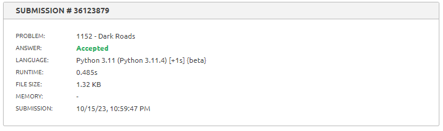
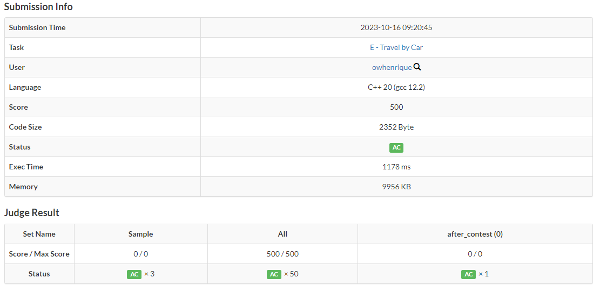
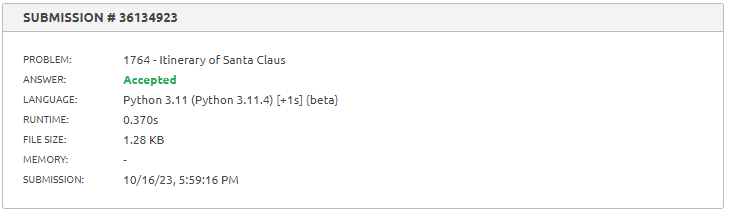
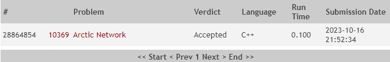

# Exercícios de juiz online

**Número da Lista**: 2<br>
**Conteúdo da Disciplina**: Grafos 2<br>

## Alunos

| Matrícula  | Aluno                           |
| ---------- | ------------------------------- |
| 17/0020291 | Paulo Henrique Almeida da Silva |
| 19/0023376 | Abraão Alves Ribeiro            |

## Sobre

Este repositório contém uma coleção de exercícios relacionados a grafos resolvidos e testados em juízes online. O objetivo principal deste projeto é fornecer soluções para problemas de grafos frequentemente encontrados em competições de programação e desafios em linha, além de servir como uma referência para estudantes e entusiastas de algoritmos gráficos.

## Organização

O projeto está organizado em diretórios individuais, cada uma contendo soluções para um problema específico. Cada solução é cuidadosamente documentada e implementada em C++ e/ou Python, com o código-fonte e uma breve descrição do problema. Além disso, os códigos estão otimizados e testados em juízes online populares para garantir sua precisão e eficiência.

## Screenshots

### [A - Dark roads](./A/A.pdf)
Submissão aceita no juiz virtual beecrowd.


### [B - Travel by car](https://atcoder.jp/contests/abc143/tasks/abc143_e)
Submissão aceita no juiz virtual atcoder.


Informações adicionais de submissão.


### [C - Itinerary of Santa Claus](./C/C.pdf)
Submissão aceita no juiz virtual beecrowd.


### [D - Arctic Network](https://onlinejudge.org/index.php?option=com_onlinejudge&Itemid=8&category=24&page=show_problem&problem=1310)
Submissão aceita no juiz virtual Online Judge.


## Instalação

**Linguagem**: C++ e Python<br>

Para executar o Exercício A, você deve ter a seguinte linguagem instalada em sua máquina:

- Python 3.x

Para executar os Exercício B, você deve ter a seguinte linguagem instalada em sua máquina:

- C++

Certifique-se de que o compilador C++ esteja corretamente instalado e configurado em seu ambiente antes de prosseguir com a execução do exercício.

## Uso

### [A - Dark Roads](./A/A.pdf)

Para compilar e executar o Exercício A digite no seu terminal os seguintes comandos:

Para compilar e executar:

```
$ python3 A.py
```

### [B - Travel by car](./B/B.pdf)

Para compilar e executar o Exercício B digite no seu terminal os seguintes comandos:

Para compilar:

```
$ g++ B.cpp -o app
```

Para executar os casos de teste (substitua X por 1 ou 2):

```
$ ./app < entradaX.txt > saida.txt
```

Para conferir se a resposta está correta (substitua X por 1 ou 2):

```
$ diff saida.txt saidaX_desejada.txt
```

### [C - Itinerary of Santa Claus](./C/C.pdf)

Para compilar e executar o Exercício C digite no seu terminal os seguintes comandos:

Para compilar e executar:

```
$ python3 C.py
```

### [D - Arctic Network](./D/D.pdf)

Para compilar e executar o Exercício D digite no seu terminal os seguintes comandos:

Para compilar:

```
$ g++ D.cpp -o app
```

Para executar os casos de teste:

```
$ ./app < entrada1.txt > saida.txt
```

Para conferir se a resposta está correta:

```
$ diff saida.txt saida1_desejada.txt
```

## Apresentação
> - [Vídeo de apresentação](./apresentacao.rar)

> - [Link para o vídeo de apresentação no youtube](https://youtu.be/JQgIr2m9bcA)
